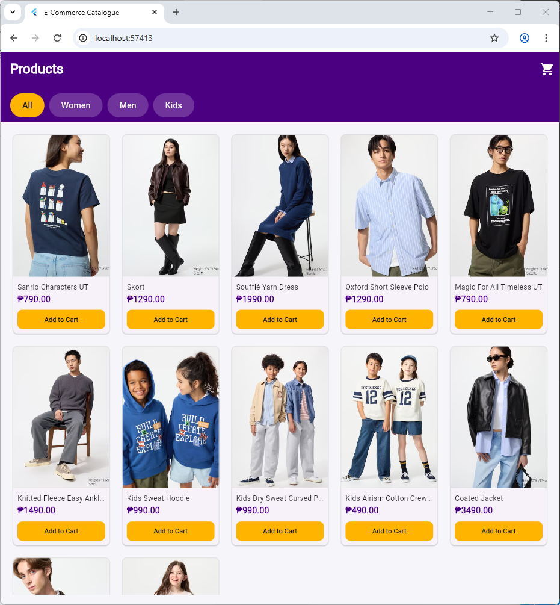
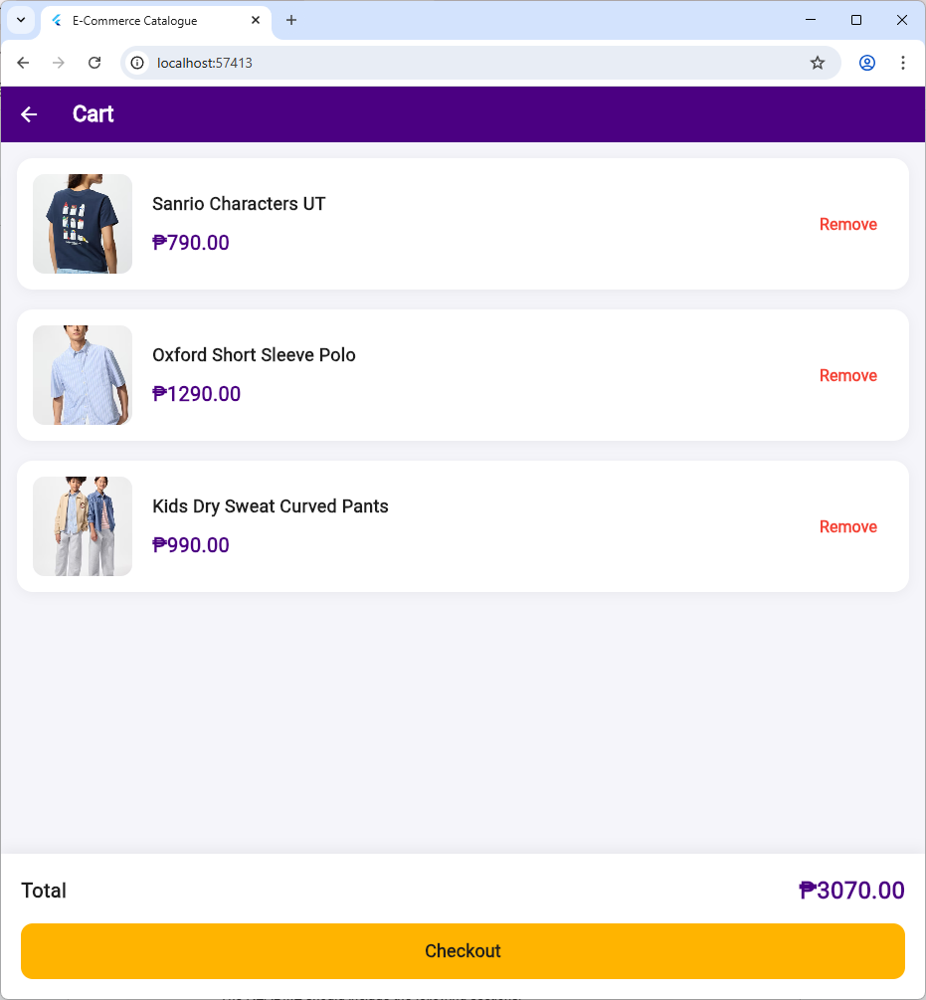

# Mini E-Commerce App


A simple **Flutter-based e-commerce demo app** that showcases the core functionalities of an online shopping experience — including browsing, product details, cart management, and checkout simulation.  
This project demonstrates clean UI design, state management, and navigation for mobile commerce applications.

---

## Preview
Example:
<p align="center">
  
  
</p>

(Check out the "Screenshots" folder for more visuals showing the navigation flow and features of the app.)

---

## Main Features
✅ **Product Catalogue** – Displays a grid of products with names, images, and prices  
✅ **Product Details** – View product descriptions and add items to cart  
✅ **Cart Management** – Add, remove, or update product quantities dynamically  
✅ **Checkout Simulation** – Confirms and resets cart for a seamless flow  
✅ **Responsive Layout** – Works across Android, iOS, and Web  
✅ **Smooth Navigation** – Bottom navigation and back stack control  
✅ **Stateful Interactions** – Real-time updates using Flutter’s state management  

---

## Widgets Used
This project uses various Flutter widgets for structure, interaction, and design.

| **Widget** | **Purpose** |
|-------------|-------------|
| `Scaffold` | Provides overall layout and app structure |
| `AppBar` | Displays title and actions for each screen |
| `ListView` / `GridView` | Lists or grids of products |
| `Card` | Displays product previews |
| `Image` | Shows product images |
| `Text` | Displays product information |
| `ElevatedButton` / `IconButton` | Handles button actions |
| `BottomNavigationBar` | Switches between screens (Home, Cart, Profile) |
| `Drawer` | (Optional) Additional navigation |
| `Container`, `Row`, `Column` | Organizes layout elements |
| `StatefulWidget` | Updates UI when cart changes |
| `Navigator` | Handles screen transitions |

---

## How to Run the Project

### 1️ Clone the Repository
```bash
git clone https://github.com/Aquino28/mini_ecommerce.git
```

### 2️ Navigate to the Project Folder
```bash
cd mini_ecommerce
```

### Install Dependencies
```bash
flutter pub get
```

### Run the Application
```bash
flutter run
```

### (Optional) Run on Web
```bash
flutter run -d chrome
```

## Note: Ensure Flutter SDK and environment variables are properly configured before running.

---
## APK Download
1. You can install the app directly on your Android device using the compiled APK:
2. Navigate to the apk/ folder in the repository.
3. Locate the file named something like mini_ecommerce-release.apk.
4. Enable installation from unknown sources on your Android device.
5. Install the APK and open the app.
---


## Project Structure
```bash
mini_ecommerce/
│
├── lib/
│   ├── main.dart                # Entry point
│   ├── pages/                   # UI pages (Product and Cart Page)
│   ├── models/                  # Product model classes
│   ├── widgets/                 # Custom reusable widgets
│   └── data/                    # Mock products
│   └── providers/               # Cart logic
│
├── assets/
│   ├── images/                  # Product and UI images
│
├── pubspec.yaml                 # Flutter dependencies
└── README.md                    # Documentation
```
### Reflection By Katrine Ingrid Aquino
Creating the mini e-commerce website was both a familiar and challenging experience. It felt familiar because I’ve previously worked on projects with similar concepts, so I already understood the basic logic and flow of how an e-commerce system should work. However, the real challenge came when I had to integrate everything using Flutter. Since Flutter was still new to me, I had to take extra time to learn how its widgets, layouts, and UI components functioned. Despite the difficulties, I see it as a valuable learning experience, and I believe that with more practice and future projects, I’ll become more confident and skilled in using Flutter and developing more complex and modern applications with it.

---
### Reflection By Anne Beatriz Villanueva
Working on the mini e-commerce app was an exciting learning experience for me because I had the opportunity to learn another programming language, Flutter. However, when it came to implementing Flutter in our e-commerce app, I encountered several challenges. I had to spend time understanding Flutter’s widgets, layouts, and state management to bring the app to life. Even though I was somewhat familiar with the concept of e-commerce systems, I still faced difficulties working with Flutter. However, this project taught me how to adapt to unfamiliar technologies, strengthened my problem-solving skills, and gave me the confidence to handle more advanced Flutter projects in the future.
